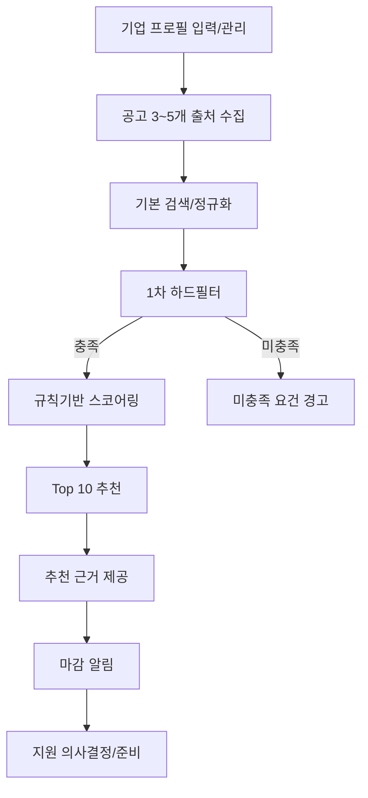
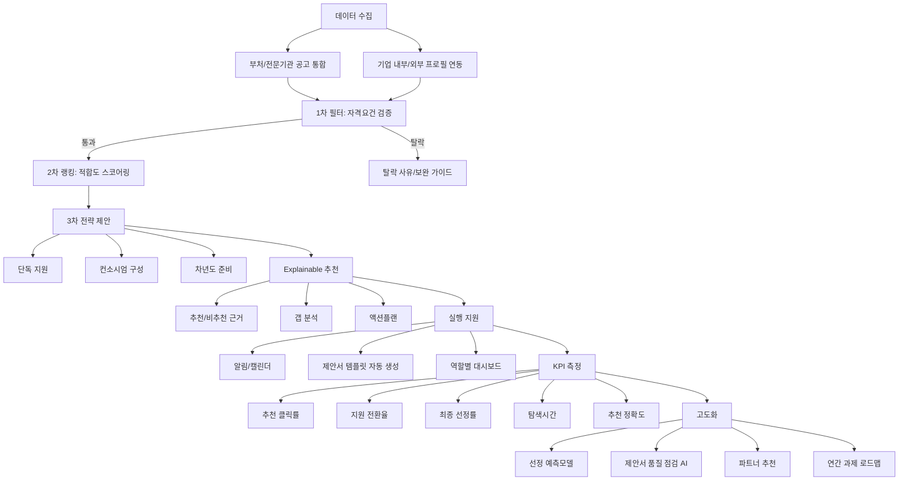

# 정부 사업과제 추천 시스템 기획안

## 1. 제품 목표 정의
- 기업별로 선정 가능성이 높은 정부 과제를 우선순위로 추천
- 추천 이유, 준비도, 액션플랜까지 제공
- 기대효과: 선정률 향상, 탐색시간 단축, 제안서 품질 향상

## 2. 핵심 기능
- 공고 통합 수집: 부처/전문기관 공고를 표준 포맷으로 정규화
- 기업 프로파일 자동화: 업종, 기술, 인증, 특허, 재무, 인력, 과거 수행실적
- 적합도 스코어링: 자격요건 충족 + 기술매칭 + 가점요소 + 경쟁강도
- Explainable 추천: 추천/비추천 근거를 항목별로 제공
- 갭 분석: 부족 요건과 보완 가이드(예: 인증 보완, 컨소시엄 필요)
- 알림/캘린더: 마감 임박, 수정공고, 질의응답 일정 추적

## 2-1. 추천시스템 입력 데이터(서류/자료)
- 목적: 추천 정확도와 설명가능성을 높이기 위해 기업·과제·시장 데이터를 구조화해 입력

### A. 기업 기본/법적 서류
- 사업자등록증, 법인등기부등본
- 최근 3개년 재무제표(매출, 영업이익, 부채비율)
- 국세/지방세 완납증명서
- 중소기업/벤처기업/이노비즈/메인비즈 확인서(해당 시)

### B. 기술/제품 자료
- 회사소개서(IR/브로슈어), 제품·서비스 소개서
- 보유 기술 설명서(핵심기술, 적용 산업, TRL)
- 특허/출원 목록, 소프트웨어 등록, 저작권 등록
- 인증서(ISO, KC, GMP 등 과제 연관 인증)

### C. 인력/조직 자료
- 참여 예정 인력 이력서(CV), 자격증, 경력기술서
- 조직도 및 전담부서 보유 여부
- 연구개발 인력 현황(학위/전공/경력)

### D. 수행실적/신뢰 자료
- 정부과제 수행 실적(선정/완료/평가등급)
- 민간 납품/PoC 실적, 레퍼런스
- 수상/인증/언론 보도 등 신뢰도 보강 자료

### E. 과제 데이터(시스템 수집)
- 공고문 원문, 신청 자격요건, 우대/가점 항목
- 평가항목/배점, 제출서류 목록, 마감일/설명회/질의응답 일정
- 수행기관, 총사업비, 지원비율, 협약 조건

### F. 운영 메타데이터
- 문서 발급일/유효기간/최종 업데이트일
- 데이터 출처(수기 입력, API, OCR), 신뢰도 레벨
- 비식별/권한등급(대표, 사업개발, 연구책임자)

### 입력 방식
- 수동 업로드: HWPX, PDF
- 반자동 파싱: OCR + 항목 추출 + 사용자 검수
- 시스템 연동: 공공 API/사내 ERP·HR·R&D 이력 DB 연계

### 문서 포맷 기반 시스템 사양
- 기본 가정: 정부 과제 신청 양식은 HWPX, 지침서·안내자료는 PDF로 처리
- 수집/업로드 허용 포맷: HWPX, PDF(스캔/텍스트)
- 파싱 파이프라인: 형식 판별 -> 텍스트 추출(OCR 포함) -> 항목 매핑(자격요건/평가항목/제출서류/일정) -> 사용자 검수
- HWPX 처리: XML(OWPML) 기반으로 본문/표/머리말 포함 추출, 항목 번호 체계 유지, 필수 서식 필드 식별
- PDF 처리: 디지털 PDF 우선 파싱, 스캔 PDF는 OCR 적용, 표/다단 레이아웃 보정
- 품질관리: 문서별 추출 신뢰도 점수 저장, 저신뢰 항목은 수동 검수 큐로 전달
- 추적성: 원문 위치(페이지/문단)와 추출 항목을 연결해 추천 근거에서 역추적 가능하게 저장
### 최소 필수 입력(MVP)
- 기업 기본정보(업종, 지역, 기업규모)
- 최근 재무지표(매출, 영업이익)
- 보유 인증/특허
- 핵심기술 키워드 5~10개
- 과거 과제 수행실적(있음/없음 + 대표 사례)

## 3. 추천 로직
### 3.1 1차 필터 (하드 필터)
- 정량 자격요건 충족 여부 확인
- 예: 매출, 업종, 지역, TRL, 기업 규모, 의무 보유 인증

### 3.2 2차 랭킹 (스코어링)
- 종합점수 예시:

`종합점수 = 자격충족도(필수) + 기술유사도 + 실적유사도 + 가점가능성 - 준비부담 - 경쟁강도`

### 3.3 3차 전략 제안
- 단독 지원 / 컨소시엄 구성 / 차년도 준비 과제로 분류
- 과제별 권장 전략과 실행 우선순위 제시

## 4. 차별화 포인트
- 추천을 넘어 선정 가능성 시뮬레이션 제공
- 기업 내부 데이터(R&D 이력, 인력 CV, 기존 제안서) 연동
- 과제별 제안서 템플릿 자동 생성(목차, 핵심문장, 체크리스트)
- 역할별 대시보드 제공(대표/사업개발/연구책임자)

## 5. MVP 범위
1. 공고 3~5개 출처 수집 및 기본 검색
2. 기업 프로필 입력/관리(수동 + 반자동 파싱)
3. 규칙기반 스코어링 및 Top 10 추천
4. 추천 근거 및 미충족 요건 경고
5. 마감 알림 기능
6. 문서 파싱: HWPX 양식 + PDF 지침서/안내자료 추출 및 검수

## 6. 고도화 로드맵
1. 과거 선정 데이터 기반 예측모델 도입
2. 평가항목 기준 제안서 품질 점검 AI
3. 컨소시엄 파트너 추천
4. 기업 포트폴리오 기반 연간 과제 로드맵 생성

## 7. KPI
- 추천 클릭률
- 지원 전환율
- 최종 선정률
- 과제 탐색 소요시간
- 추천 정확도(담당자 피드백 기반)
- 월간 활성 기업/담당자 수

## 8. 다음 단계 제안
- IA(화면 구조) 상세화
- 데이터 스키마 설계
- 스코어링 규칙 및 가중치 상세 설계
- PoC 일정 및 검증지표 정의

## 9. 시스템 개발 환경 권장안
- 기준일: 2026-02-26

### 권장 개발 환경(최적안)
- OS: 개발자 로컬은 Windows 11 + WSL2(Ubuntu)
- 문서처리: Linux 컨테이너 기반 파서 워커 운영(HWPX/PDF 처리)
- Backend: Python 3.12+, FastAPI, Pydantic
- DB: PostgreSQL 18 + pgvector (정형 데이터 + 추천/유사도)
- 검색: OpenSearch (공고문/지침 전문검색, 하이브리드 검색)
- 캐시/큐: Redis (작업 큐, 캐시, rate limit)
- 파이프라인: Airflow (수집/파싱/스코어링 배치 오케스트레이션)
- 문서 파싱:
  - HWPX: XML(OWPML) 직접 파싱
  - PDF: 텍스트 PDF 직접 추출 + 스캔 PDF는 OCR(Tesseract)
- Infra: 개발 Docker Compose, 운영 Kubernetes
- 품질: pytest + ruff + mypy + pre-commit
- 관측: Prometheus + Grafana + OpenTelemetry

### 선정 이유
- 정부 과제 문서 특성(HWPX + PDF)을 안정적으로 처리하려면 문서처리 계층 분리가 필요
- 추천 시스템 핵심인 관계형 데이터 + 벡터검색 + 워크플로 자동화 3축을 운영 난이도 대비 효율적으로 충족

### 참고 소스
- HWPX/OWPML 배경(한컴): https://help.hancom.com/hoffice130_assistant/ko-KR/Hwp/file/open/open%28other%29.htm
- HWPX 변환기/표준 안내(한컴 FAQ): https://www.hancom.com/support/faqCenter/faq/detail/3131
- FastAPI 공식 문서: https://fastapi.tiangolo.com/
- pgvector 공식 저장소: https://github.com/pgvector/pgvector
- PostgreSQL 18 문서: https://www.postgresql.org/docs/
- OpenSearch 벡터 검색: https://docs.opensearch.org/latest/vector-search/api/index/
- Apache Airflow 문서: https://airflow.apache.org/docs/
- Docker Compose 설치 가이드: https://docs.docker.com/compose/install/
- Kubernetes 아키텍처: https://kubernetes.io/docs/concepts/architecture/
- Tesseract OCR: https://github.com/tesseract-ocr/tesseract

## Flow Chart

### 1) MVP 중심 흐름

### 2) 전체 서비스 흐름

