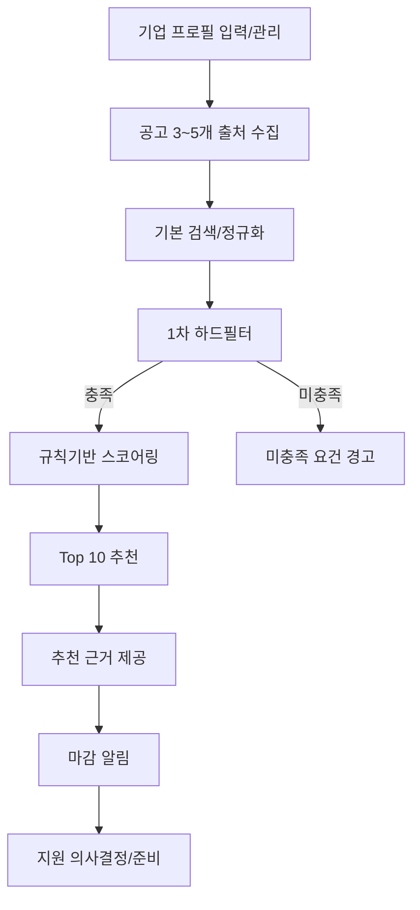
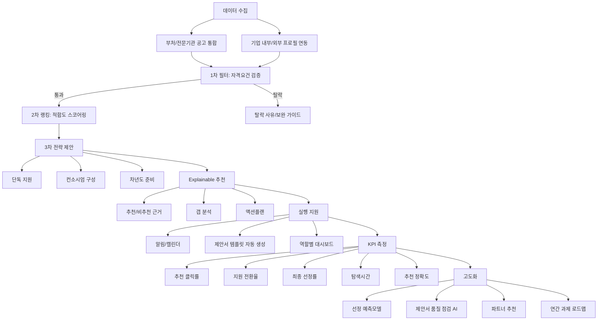

# 정부 사업과제 추천 시스템 개발 기획안 (재구성)

## 1. 프로젝트 개요
### 1.1 목표
- 기업별로 선정 가능성이 높은 정부 과제를 우선순위로 추천
- 추천 이유, 준비도, 액션플랜까지 제공
- 과제 탐색부터 지원 의사결정까지의 시간을 단축

### 1.2 기대효과
- 최종 선정률 향상
- 과제 탐색시간 단축
- 제안서 품질 향상

### 1.3 범위
- 입력 문서 포맷: HWPX, PDF
- 초기 범위: 과제 검색, 자격 필터링, 스코어링, 추천 근거 제공, 알림

## 2. 사용자 및 업무 흐름
### 2.1 주요 사용자
- 대표/의사결정자: 지원 우선순위 및 투자 판단
- 사업개발 담당자: 과제 탐색, 일정 관리, 지원 준비
- 연구책임자: 기술 적합성 검토, 수행전략 수립

### 2.2 정부 사업과제 검색 절차
1. 기업 프로필 입력
- 업종, 지역, 기업규모, 매출, 인증/특허, 기술 키워드 입력

2. 검색 조건 설정
- 과제 유형(R&D/사업화/수출), 지원금 규모, 마감일, 주관부처, 지역 조건 선택

3. 1차 필터 적용
- 자격요건(업종/매출/기업규모/지역/필수 인증) 미충족 과제 자동 제외

4. 2차 랭킹 확인
- 기술유사도, 실적유사도, 가점 가능성, 경쟁강도 반영 Top N 추천 확인

5. 상세 공고 열람
- 추천/비추천 사유, 제출서류, 평가항목, 마감 일정 확인

6. 액션 실행
- 부족 요건 보완(인증/파트너), 알림 등록, 지원 여부 결정

## 3. 기능 요구사항
### 3.1 핵심 기능
- 공고 통합 수집: 부처/전문기관 공고를 표준 포맷으로 정규화
- 기업 프로파일 자동화: 업종, 기술, 인증, 특허, 재무, 인력, 과거 수행실적 관리
- 적합도 스코어링: 자격요건 + 기술매칭 + 가점요소 + 경쟁강도 반영
- Explainable 추천: 추천/비추천 근거를 항목별 제공
- 갭 분석: 부족 요건과 보완 가이드 제시
- 알림/캘린더: 마감 임박, 수정공고, 질의응답 일정 추적

### 3.2 차별화 기능
- 선정 가능성 시뮬레이션
- 기업 내부 데이터(R&D 이력, 인력 CV, 기존 제안서) 연동
- 과제별 제안서 템플릿 자동 생성(목차, 핵심문장, 체크리스트)
- 역할별 대시보드(대표/사업개발/연구책임자)

## 4. 데이터 및 입력 문서 사양
### 4.1 입력 데이터 분류
- 기업 기본/법적 서류: 사업자등록증, 법인등기부등본, 재무제표, 완납증명서, 각종 확인서
- 기술/제품 자료: 회사소개서, 기술 설명서, 특허/출원, 인증서
- 인력/조직 자료: 참여 인력 CV, 자격증, 조직도, 연구인력 현황
- 수행실적/신뢰 자료: 정부과제 실적, 민간 레퍼런스, 수상/보도 자료
- 과제 데이터(수집): 공고문, 자격요건, 우대/가점, 평가항목/배점, 일정, 예산/협약 조건
- 운영 메타데이터: 발급일/유효기간/최종 수정일, 데이터 출처, 신뢰도 레벨, 권한등급

### 4.2 문서 포맷 기반 시스템 사양
- 기본 가정: 신청 양식은 HWPX, 지침/안내자료는 PDF
- 허용 포맷: HWPX, PDF(텍스트/스캔)
- 파이프라인: 형식 판별 -> 텍스트 추출(OCR 포함) -> 항목 매핑 -> 사용자 검수
- HWPX 처리: XML(OWPML) 기반 본문/표/머리말 추출, 항목 번호 체계 유지
- PDF 처리: 디지털 PDF 우선 파싱, 스캔 PDF는 OCR 적용, 표/다단 레이아웃 보정
- 품질관리: 추출 신뢰도 점수 저장, 저신뢰 항목은 수동 검수 큐로 이관
- 추적성: 원문 위치(문서/페이지/문단)와 추출 항목 연결

### 4.3 입력 방식 및 MVP 최소 입력
- 입력 방식: 수동 업로드(HWPX, PDF), 반자동 파싱(OCR+검수), 시스템 연동(API/내부 DB)
- MVP 최소 입력: 업종/지역/기업규모, 최근 재무지표, 보유 인증/특허, 기술 키워드 5~10개, 과거 수행실적

## 5. 추천 엔진 및 과제 평가 로직
### 5.1 1차 필터 (Hard Filter)
- 정량 자격요건 충족 여부 확인
- 예: 매출, 업종, 지역, TRL, 기업 규모, 필수 인증

### 5.2 2차 랭킹 (Scoring)
- 종합점수 = 자격충족도(필수) + 기술유사도 + 실적유사도 + 가점가능성 - 준비부담 - 경쟁강도

### 5.3 3차 전략 제안
- 단독 지원 / 컨소시엄 구성 / 차년도 준비로 분류
- 과제별 권장 전략과 실행 우선순위 제시

### 5.4 설명가능성 및 검증
- 추천 근거/비추천 사유를 항목별 제시
- 미충족 요건 경고 및 보완 액션 제공
- 근거 문장 + 원문 위치 저장으로 감사 가능성 확보

## 6. 시스템 아키텍처
### 6.1 논리 아키텍처
- 수집 계층: 공고 크롤링/API 수집, 정규화
- 문서처리 계층: HWPX/PDF 파서 워커, OCR, 구조화
- 추천 계층: 필터링, 스코어링, 전략 분류
- 서비스 계층: API, 검색, 알림, 대시보드
- 운영 계층: 모니터링, 로깅, 배치 스케줄링

### 6.2 데이터/플랫폼 구성
- Backend: FastAPI + Pydantic
- 데이터 저장: PostgreSQL 18 + pgvector
- 검색: OpenSearch
- 캐시/큐: Redis
- 워크플로: Airflow
- 인프라: 개발 Docker Compose, 운영 Kubernetes

## 7. 개발 환경 및 엔지니어링 원칙
### 7.1 개발 전제
- VS Code + Claude Code/Codex 기반 vibe coding
- AI 페어 코딩 + 사람 설계/검토/승인(휴먼 인 더 루프)

### 7.2 권장 개발 언어
- 메인 언어: Python 3.12+
- 보조 언어: TypeScript(UI), SQL(분석/튜닝)

### 7.3 품질/협업 기준
- 품질 게이트: pytest + ruff + mypy + pre-commit
- PR 기준: 테스트 통과, 타입체크 통과, 린트 통과, 변경 의도/프롬프트 기록
- 관측성: Prometheus + Grafana + OpenTelemetry

### 7.4 LLM 과제평가 지침서 관리 원칙
- 과제 평가용 LLM 지침서는 코드 하드코딩 대신 별도 파일로 관리
- 권장 구조: prompts/, policies/, versions/
- 코드 역할: 로딩, 스키마 검증, 버전 선택, 실행 로깅
- 운영 원칙: 버전 이력/롤백 가능, 환경별 분리, 코드 배포 없는 정책 업데이트

## 8. 개발 계획
### 8.1 MVP 범위
1. 공고 3~5개 출처 수집 및 기본 검색
2. 기업 프로필 입력/관리(수동 + 반자동 파싱)
3. 규칙기반 스코어링 및 Top 10 추천
4. 추천 근거 및 미충족 요건 경고
5. 마감 알림 기능
6. 문서 파싱(HWPX 양식 + PDF 지침/안내자료 추출 및 검수)

### 8.2 다음 단계 제안
- IA(화면 구조) 상세화
- 데이터 스키마 설계
- 스코어링 규칙 및 가중치 상세 설계
- PoC 일정 및 검증지표 정의

### 8.3 고도화 로드맵
1. 과거 선정 데이터 기반 예측모델 도입
2. 평가항목 기준 제안서 품질 점검 AI
3. 컨소시엄 파트너 추천
4. 기업 포트폴리오 기반 연간 과제 로드맵 생성

## 9. 운영, 보안, 성능 관리
### 9.1 KPI
- 추천 클릭률
- 지원 전환율
- 최종 선정률
- 과제 탐색 소요시간
- 추천 정확도(담당자 피드백 기반)
- 월간 활성 기업/담당자 수

### 9.2 추가 운영 권장사항
1. 평가 기준 정량화
- 점수식 가중치/임계값 문서화 및 변경 이력 관리

2. 오프라인 평가셋 구축
- 과거 데이터 기반 정답셋으로 정기 성능 측정

3. LLM 출력 스키마 강제
- JSON Schema/Pydantic 고정, 파싱 실패 자동 재시도

4. 휴먼 검수 워크플로
- 저신뢰/경계 케이스는 사람 승인 후 진행

5. 프롬프트/룰 A/B 테스트
- 지침서 버전별 정확도/재현율/만족도 비교

6. 데이터 계약(Data Contract)
- 공고/기업/평가 스키마 계약 기반 운영

7. 보안·권한 모델
- 원문 암호화, RBAC, 감사 로그 적용

8. 비용/성능 지표
- LLM 토큰비용, 처리시간, 실패율, 재처리율 상시 모니터링

9. 장애 대비
- 큐 재처리, Dead Letter Queue, 백업/복구(RPO/RTO) 기준 정의

## 10. 참고 기술 문서
- FastAPI: https://fastapi.tiangolo.com/
- pgvector: https://github.com/pgvector/pgvector
- PostgreSQL: https://www.postgresql.org/docs/
- OpenSearch: https://docs.opensearch.org/latest/vector-search/api/index/
- Airflow: https://airflow.apache.org/docs/
- Docker Compose: https://docs.docker.com/compose/install/
- Kubernetes: https://kubernetes.io/docs/concepts/architecture/
- Tesseract OCR: https://github.com/tesseract-ocr/tesseract

## 11. Flow Chart
### 11.1 MVP 중심 흐름

### 11.2 전체 서비스 흐름

